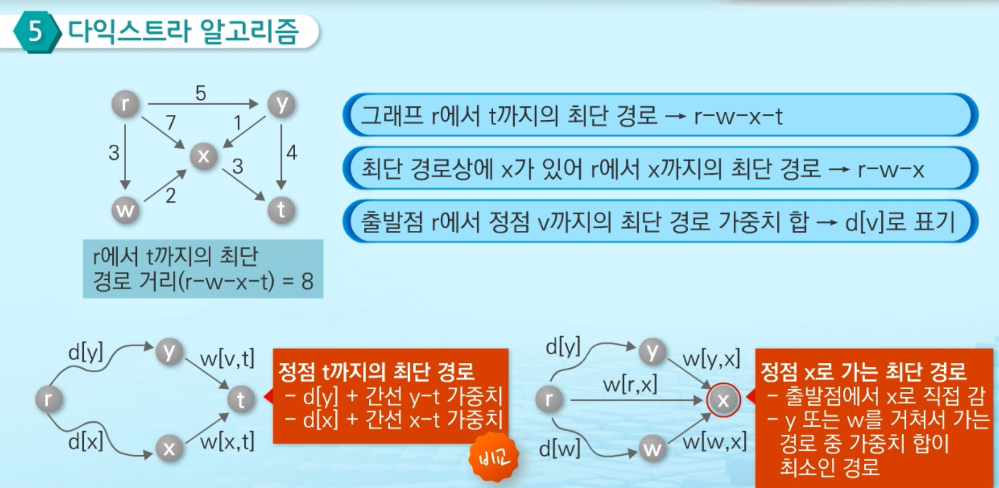

다익스트라 알고리즘에 대해 알아보자.


## 다익스트라 알고리즘(Dijkstra algorithm)

#### 다익스트라 알고리즘이란?

- 시작 정점에서 거리가 최소인 정점부터 선택해 나가면서 최단 경로를 구하는 방식

- 탐욕 기법을 사용한 알고리즘으로 최소 신장 트리를 구하는 프림 알고리즘과 유사

- 시작 정점(r)에서 끝 정점(t)까지의 최단 경로에 정점 x가 존재

  => 최단 경로는 r에서 x까지의 최단 경로와 x에서 t까지의 최단 경로로 구성


#### 동작 방식

<center></center>

- 시작점에서의 최단 경로를 찾은 정점들의 집합(S)을 관리
  - 최초 $S = \{r\}, d[r] = 0, d[v] = INF (v\in V - U)$
  - 최단 경로를 찾은 정점을 하나씩 집합 S에 추가
  - 집합 S에 포함되지 않은 정점들 중에 출발점에 가장 가까운 정점 선택


#### 탐욕적 방법으로 정점 선택하기

- 집합 S에 포함되지 않은 v를 선택해서 집합 S에 포함시키려고 함
- 집합 S에서 v로 가는 경로의 마지막은 정점 u에서 나오는 간선
- 출발점 r에서 v까지의 최단 경로 d[u] + w(u, v)
- 출발점에 v로 가는 임의의 경로 P가 있다고 가정할 경우 P'는 P의 부분 경로


#### 코드

```python
# D: 출발점에서 각 정점까지 최단 경로 가중치 합을 저장
# P: 최단 경로 트리 저장
def Dijkstra(G, r):
    D = [INF] * N
    P = [None] * N
    visited = [False] * N
    D[r] = 0
    
    for _ in range(N):
        m_idx = -1
        mn = INF
        for i in range(N):
            if not visited[i] and D[i] < mn:
                mn = D[i]
                m_idx = i
        visited[m_idx] = True
    	for v, val in G[m_idx]:
            if not visited[v] and D[m_idx] + val < D[v]:
                D[v] = D[m_idx] + val
                P[v] = m_idx
```

=> 음의 가중치를 포함한 그래프에서 제대로 동작하지 않음


#### 코드 리팩토링

1. G가 N *N 행렬일 때

   ```python
   def dijkstra(G, s):
       N = len(G)
       distance = [1e9] * N
       visited = [False] * N
       parents = [None] * N
       distance[s] = 0
   
       for _ in range(N):
           mn = 1e9
           m_idx = -1
           for i in range(N):
               if not visited[i] and distance[i] < mn:
                   mn = distance[i]
                   m_idx = i
           visited[m_idx] = True
           
           for j in range(N):
               if not visited[j] and G[m_idx][j] > 0 and G[m_idx][j] + mn < distance[j]:
                   distance[j] = G[m_idx][j] + mn
                   parents[j] = m_idx
   ```

2. G가 u, v, w 일 때

   ```python	
   def dijkstra(G, s):
       N = len(G)
       distance = [1e9] * N
       visited = [False] * N
       parents = [None] * N
       distance[s] = 0
   
       for _ in range(N):
           mn = 1e9
           m_idx = -1
           for i in range(N):
               if not visited[i] and distance[i] < mn:
                   mn = distance[i]
                   m_idx = i
           visited[m_idx] = True
   
           for u, v, w in G:
               if not visited[u] and w + mn < distance[v]:
                   distance[v] = mn + w
                   parents[v] = m_idx
   ```

   

   

   


## 벨만-포드 알고리즘

- 다익스트라와 달리 음의 가중치를 포함하는 그래프에서 최단 경로를 구한다.
  - 단, 가중치의 합이 음인 사이클은 허용하지 않음
  - 다익스트라로 최단 경로를 구할 수 있다면 벨만-포드로 가능
- 출발점에서 각 정점까지 간선 하나로 구성된 경로만 고려해서 최단 경로를 구함
- 최대 간선 두 개까지 고려해서 최단 경로를 구해나가서 최대 간선 n-1개까지 고려한 경로들에서 최단 경로를 구함(n은 정점의 개수)
  - 동적 계획법 적용
- 다익스트라에 비해 많은 시간 소요